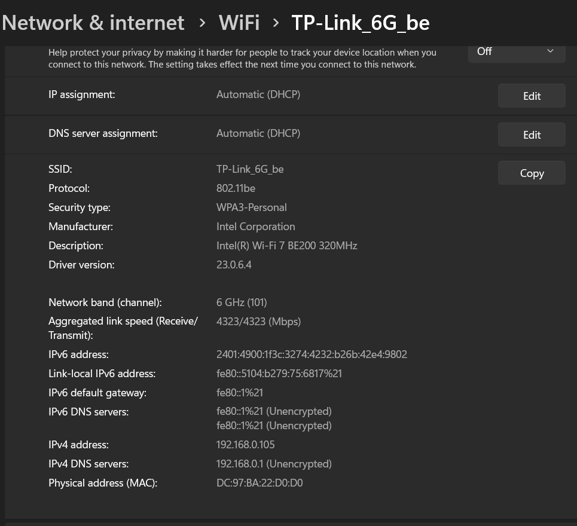
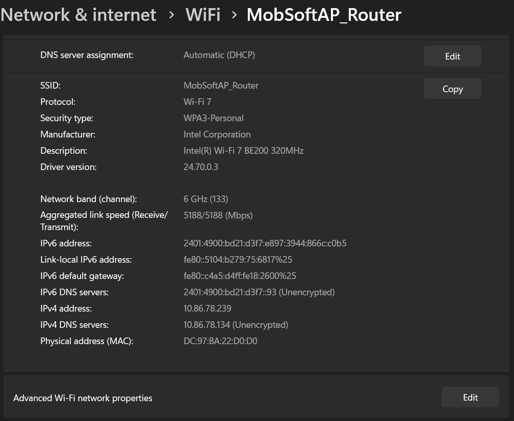

# Windows 6 GHz Wi‑Fi Testing in India — Intel BE200 / AX411 / AX210

This repository documents my real Windows PC testing of 6 GHz Wi‑Fi using Intel adapters, with emphasis on higher 6 GHz channels and older Intel driver behavior.

> **Important:** This is a technical test record, not a regulatory-bypass guide. Channel availability and permitted operation depend on the AP, client, firmware, driver, and local regulations. Use only frequencies/channels permitted for your location and equipment.

## Confirmed Test Platform

| Component | Test result |
|---|---|
| Motherboard | **Gigabyte B760M DS3H AX Rev. 1.2** |
| Confirmed adapter | **Intel Wi‑Fi 7 BE200 320MHz — standalone PCIe/M.2** |
| Built-in adapter | **Intel AX411 / CNVio2 — same full-band behavior not reproduced** |
| Operating system | Windows |
| Tested Intel driver | **23.0.6.4** |
| Working driver branch/service | **Netwtw14** |
| Windows Home Location | **India (GeoId 113)** /**US (GeoId 244)** |

## Main Result

With the standalone Intel BE200 and Intel driver **23.0.6.4 / Netwtw14**, Windows successfully detected and connected to 6 GHz Wi‑Fi on the tested higher channels without patching the Intel driver, modifying Intel firmware, forcing a country code in the adapter registry, or disabling LAR through a custom registry hack.

Confirmed observations include:

- **Channel 37** — easiest / most consistent visibility in my testing
- **Channel 101** — easy visibility and confirmed active 802.11be connection
- **Channel 165** — successfully detected; discovery can be less consistent than Ch 37/101
- Intel BE200 link rates in testing have reached up to approximately **5764 Mbps** under favorable conditions
- after reboot PC you may need to desable Wifi adapter & re-enable to see/connect 6ghz full band ch 37 to 213
- PCI M2 card is suitable Motherboard inbuilt Card not works terst on Intel ax411.
## Screenshot Evidence

### BE200 — Windows Network Properties

The screenshots below are the actual Windows test captures stored in this repository.





The captured Windows properties show the Intel BE200 using the tested **23.0.6.4** driver and a 6 GHz / 802.11be connection on the tested setup.

## Active Connection Proof — Channel 101

Windows Network Properties reported:

```text
SSID           : TP-Link_5G-6G_MLO
Protocol       : 802.11be
Adapter        : Intel(R) Wi-Fi 7 BE200 320MHz
Driver Version : 23.0.6.4
Network Band   : 6 GHz
Channel        : 101
Link Speed     : 5188 / 5188 Mbps
Security       : WPA3-Personal
```

The link rate is dynamic. In my testing the same BE200 320 MHz setup has reached approximately **5764 Mbps** under favorable conditions.

## Live Interface Proof — `netsh wlan show interfaces`

Command:

```powershell
netsh wlan show interfaces
```

Relevant output from the India-region retest:

```text
Description            : Intel(R) Wi-Fi 7 BE200 320MHz
State                  : connected
SSID                   : TP-Link_5G-6G_MLO
AP BSSID               : ba:6e:84:e3:5d:f5
Band                   : 6 GHz
Channel                : 101
Radio type             : 802.11be
Authentication         : WPA3-Personal (H2E)
Receive rate (Mbps)    : 5188.8
Transmit rate (Mbps)   : 5188.4
Signal                 : 89%
Rssi                   : -49
```

The live `netsh` receive/transmit values can change moment by moment and therefore do not need to match the higher link-speed value shown by Windows Network Properties.

## PowerShell / NETSH Scan Evidence

Command:

```powershell
netsh wlan show networks mode=bssid
```

### Channel 101

```text
SSID : TP-Link_5G-6G_MLO
    Authentication          : WPA3-Personal
    Encryption              : CCMP
    BSSID 1                 : ba:6e:84:e3:5d:f5
         Signal             : 89%
         Radio type         : 802.11be
         Band               : 6 GHz
         Channel            : 101
         Details            : (H2E Required) (MLD)
         MLD Address        : a8:6e:84:e3:5d:f5
```

A separate 6 GHz SSID from the same AP was also visible:

```text
SSID : TP-Link_6G_be
    Authentication          : WPA3-Personal
    Encryption              : CCMP
    BSSID 1                 : ba:6e:84:e3:5d:f4
         Signal             : 90%
         Radio type         : 802.11be
         Band               : 6 GHz
         Channel            : 101
         Details            : (H2E Required) (MLD)
```

### Channel 165 — detected after India-region reboot

```text
SSID 1 : MobSoftAP_Router
    Network type            : Infrastructure
    Authentication          : WPA3-Personal
    Encryption              : CCMP
    BSSID 1                 : 36:63:b2:35:86:52
         Signal             : 86%
         Radio type         : 802.11be
         Band               : 6 GHz
         Channel            : 165
         Details            : (H2E Required) (MLD)
         MFP Required       : 1
```

This confirms that the normal Windows WLAN scanner detected an **802.11be / 6 GHz AP on Channel 165** in the tested configuration.

## Tested with Windows Home Location set to India

Before the final retest, Windows Home Location was set to India:

```powershell
Get-WinHomeLocation
```

Result:

```text
GeoId HomeLocation
----- ------------
113   India
```
```powershell
Get-WinHomeLocation
```

Result:

```text
GeoId HomeLocation
----- ------------
244   US
```
The PC was rebooted after changing the Home Location. After reboot, Channel 101 still connected successfully and Channel 165 was still detected by the normal Windows scan.

> Windows Home Location and the Wi‑Fi radio regulatory domain are not necessarily the same mechanism. This only documents the actual Windows Home Location used during the successful retest.

## What “No Modification” Means

The successful BE200 result does **not** use:

- patched Intel `.sys` files
- custom Intel firmware
- a `DisableLAR` registry hack
- a forced `CountryCode` / `RegDomain` value
- Windows regulatory database editing
- custom Windows system files
- Linux `iw reg set`

The working package is an Intel Windows Wi‑Fi driver package, with Windows reporting **23.0.6.4 / Netwtw14**.

The working BE200 registry export was checked for obvious user-level regulatory overrides. No explicit `DisableLAR`, `CountryCode`, `RegDomain`, `RegulatoryDomain`, FCC/world-domain override, or similar country-forcing value was found.

Intel-defined 6 GHz settings in the driver package include normal parameters such as:

```text
Is6GhzBandSupported
ChannelWidth6
RoamingPreferredBandType
```

These are ordinary Intel adapter options, not evidence of a regulatory bypass.

## Why the Older Intel Driver Can Behave Differently

A strings-level comparison was made between the working **Netwtw14** binary and a newer **Netwtw18** branch binary.

Both contain Intel LAR/regulatory-related logic, so the working result should **not** be described as “LAR removed” or “LAR disabled.”

Examples found in the working Netwtw14 branch include:

```text
mhiffLariChangeConfigCmdVer6
EV_MMAC_LAR_MCC_NOTIFICATION
EV_MMAC_LAR_MCC_TEST_MODE_STATE_CHANGED
7001 - 11d Location MCC value (WRDD)
mUtilReadNewRegulatoryLimits
mhiffTranslatRegulatoryTasConfigVer4
```

Examples found in the newer Netwtw18 branch include:

```text
mhiffLariChangeConfigCmdVer12
mhiffLariChangeConfigCmdVer13
mhiffLariConfigOverrideCmdVer1
prvLarRemoveBssEntriesWithInvalidChannels
prvUpdateHe160RatesAcordingToLar
getWifiCountryRegionList
prvBssVifTelemetryGetCountryCodeFromIeMap
prvhSpctrmHandleCountryIe
prvhSpctrmSet11dCountryOid
mhiffTranslatRegulatoryTasConfigVer5
```

One particularly interesting newer-driver symbol is:

```text
prvLarRemoveBssEntriesWithInvalidChannels
```

Its name suggests that newer LAR logic can remove BSS scan entries considered invalid by the driver. This is consistent with the practical observation that newer driver branches can detect 6 GHz faster but behave more restrictively for some higher 6 GHz channels.

This remains an implementation-level observation from binary strings; it is **not proof of the exact internal decision path**.

## 6 GHz Detection Speed Observation

In my testing:

| Behavior | Older 23.0.6.4 / Netwtw14 | Newer Netwtw18 branch |
|---|---|---|
| 6 GHz discovery | Can take roughly **2–3 minutes** | Usually much faster |
| Higher-channel visibility | Better in my BE200 testing | Can be more restrictive |
| LAR/regulatory logic | Present | Present, newer implementation |

So with the older driver, users should not immediately assume 6 GHz is unavailable if it does not appear on the first scan. Waiting a few minutes and rescanning can matter.

## AX411 vs BE200 Hardware Result

The motherboard-integrated **AX411** did **not** reproduce the same full-band/high-channel behavior on this system.

```text
Built-in AX411
→ CNVio2 / platform-integrated path
→ Same full-band behavior NOT reproduced

Standalone BE200
→ PCIe/USB M.2 path
→ Driver 23.0.6.4 / Netwtw14
→ Ch 101 active connection confirmed
→ Ch 165 visibility confirmed
```

This suggests the behavior depends on the **specific adapter architecture plus Intel driver/firmware path**, not only on a generic Windows registry setting.

## AX210 / AX211 Candidate Notes

The **Intel AX210** is a standalone PCIe/USB M.2 Wi‑Fi 6E adapter and is therefore a stronger candidate for this experiment than CNVio2-based AX211/AX411.

Public user reports have already shown AX210 6 GHz operation working with older Intel drivers in situations where newer drivers did not expose 6 GHz correctly. That supports AX210 as a plausible candidate, but the exact Ch 37–213 / Ch 101 / Ch 165 behavior documented here with BE200 still needs direct AX210 testing.

Current view:

```text
AX210 (PCIe/USB M.2) → Not yet tested here; strong candidate. Older-driver 6 GHz operation has been reported publicly.
AX211 (CNVio2)       → Different platform-integrated architecture.
AX411 (CNVio2)       → Tested here; same full-band/high-channel behavior not reproduced.
BE200 (PCIe/USB M.2) → Confirmed working in this project.
```

## Required / Tested Driver

```text
Intel Wi‑Fi Driver : 23.0.6.4
Driver branch      : Netwtw14
```

For the closest reproduction, use the same driver version.

### Clean driver installation

1. Temporarily disconnect the PC from the Internet.
2. Open **Device Manager → Network adapters**.
3. Select the Intel Wi‑Fi adapter.
4. Choose **Uninstall device**.
5. If shown, select **Attempt to remove the driver for this device**.
6. Reboot if requested.
7. Install Intel Wi‑Fi driver **23.0.6.4**.
8. Reboot Windows.
9. Verify the active version under **Device Manager → adapter → Properties → Driver**.

If Windows keeps restoring another Intel package from the Driver Store, remove the unwanted package first. Do not let Windows Update replace the test driver while reproducing the result.

## Evidence Summary

| Evidence | Ch 37 | Ch 101 | Ch 165 |
|---|:---:|:---:|:---:|
| Seen in BE200 testing | ✅ | ✅ | ✅ |
| NETSH evidence currently documented | To add | ✅ | ✅ |
| 802.11be shown by Windows | To add | ✅ | ✅ |
| Active connection proof | To add | ✅ | To add |
| India Home Location + reboot retest | To add | ✅ | ✅ visibility |
| Discovery consistency | Excellent | Excellent | Less consistent |

## Save Your Own Evidence

Save a complete scan:

```powershell
netsh wlan show networks mode=bssid > 6ghz-scan.txt
```

Show the current connection:

```powershell
netsh wlan show interfaces
```

Useful reproduction details include motherboard/CPU, adapter model, whether the adapter is CNVio or standalone PCIe/M.2, exact Intel driver version, Windows build, Windows Home Location, AP/router model and firmware, selected 6 GHz channel, and the raw `netsh` output.

## Compatibility Notes

Behavior may vary with:

- Intel CPU/platform generation
- motherboard M.2 / CNVio / PCIe implementation
- adapter architecture
- BIOS version
- Windows build
- Intel driver version
- router/AP firmware
- AP regulatory configuration

The **Gigabyte B760M DS3H AX Rev. 1.2 + standalone Intel BE200** combination is the confirmed reference platform for the high-channel result documented here.

## Disclaimer

This repository documents personal/laboratory test observations. It does **not** grant permission to operate on frequencies restricted in your jurisdiction. Regulatory limits differ by country and can change over time. Always follow the current rules applicable to your location and equipment.
